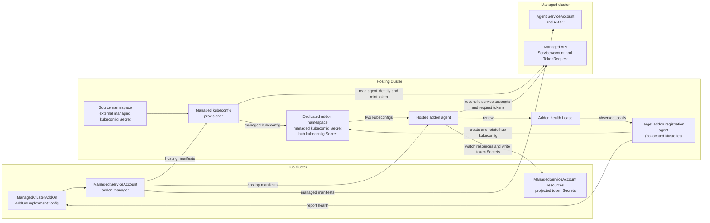

# Managed Service Account

## Overview

The Managed Service Account addon is an Open Cluster Management (OCM) addon built on the [addon-framework](https://github.com/open-cluster-management-io/addon-framework). It synchronizes [ServiceAccount](https://kubernetes.io/docs/tasks/configure-pod-container/configure-service-account/) resources to managed clusters and collects their authentication tokens back to the hub cluster as secret resources.

## Use Cases

This addon is beneficial when you need to:

- Deploy service account resources to managed clusters without requiring a kubeconfig to each managed cluster
- Access the Kubernetes API of managed clusters from the hub cluster using valid authentication tokens  
- Standardize client identity by using the same service account across managed cluster API requests

## Architecture

The addon follows the standard OCM [addon architecture](https://open-cluster-management.io/concepts/addon/).
It supports two addon agent placements. `installMode` is an addon-framework
render value passed to the agent chart, not a value of the hub Helm chart:

- **Agent on the managed cluster** (`installMode=Default`): the addon agent runs
  on the cluster it manages.
- **Agent on a hosting cluster** (`installMode=Hosted`): the addon agent and a
  kubeconfig provisioner run on a separate hosting cluster, while the
  managed-side identity and RBAC remain on the managed cluster.

**Addon Manager**
- Renders and distributes resources for both agent placements
- Manages registration, placement, configuration, and required resources

**Addon Agent**  
- Monitors the ManagedServiceAccount API resources
- Manages service accounts and requests their tokens through the managed-cluster API
- Periodically projects those tokens as secret resources to the hub cluster
- Handles token refresh according to the configured rotation policy

**Managed Kubeconfig Provisioner (agent on a hosting cluster only)**
- Uses an external managed-cluster kubeconfig to mint a short-lived token for
  the agent's managed-cluster service account
- Generates the agent's managed-cluster kubeconfig; the target klusterlet's
  addon registration agent creates and rotates the hub kubeconfig on the
  hosting cluster as configured by addon-framework

### Installation Methods

The managed service account addon supports 2 installation ways:

- **`hubDeployMode=Deployment` (addon-framework manager - agent)**: Full deployment with both addon manager and addon agent components.
  This is the only installation method that supports placing an agent on a
  hosting cluster. The addon manager runs under the hub manager's leader
  election. When replacing an AddOnTemplate installation, it also preserves
  Lease-based addon health reporting.
- **`hubDeployMode=AddOnTemplate`**: Addon-manager driven install with the addon agent by default. Enabling
  `featureGates.clusterProfile=true` also deploys the hub manager. Placing an
  agent on a hosting cluster is not supported with this installation method.

## Installation

### Prerequisites

- Open Cluster Management (OCM) registration (version >= 0.5.0)

### Installation Steps

Install the addon using Helm charts:

```shell
# Add the OCM Helm repository
helm repo add ocm https://open-cluster-management.io/helm-charts/
helm repo update

# Search for the managed-serviceaccount chart
helm search repo ocm/managed-serviceaccount

# Install the addon
helm install \
    -n open-cluster-management-addon --create-namespace \
    managed-serviceaccount ocm/managed-serviceaccount
```

### Verification

Confirm the installation was successful:

```shell
kubectl get managedclusteraddon -A | grep managed-serviceaccount
```

Expected output:
```
NAMESPACE        NAME                     AVAILABLE   DEGRADED   PROGRESSING
<your-cluster>   managed-serviceaccount   True        False      False
```

## Usage

### Prometheus Metrics Scraping

Set `prometheus.enabled=true` to expose addon metrics with Prometheus
`ServiceMonitor` resources. For addon agent metrics, configure the
`ManagedClusterAddOn` with an `AddOnDeploymentConfig`; see
`deploy/samples/addon-agent-metrics-scraping.yaml` for an example.

The Prometheus Operator `ServiceMonitor` CRD must exist on the cluster where the
ServiceMonitor is applied: the hub cluster for manager metrics, the managed
cluster for metrics from an agent running on the managed cluster, and the
hosting cluster for metrics from an agent running there. If the CRD is missing,
installation fails or the add-on status reports an apply failure.

### Creating a ManagedServiceAccount

Create a sample ManagedServiceAccount resource:

```shell
kubectl create -f - <<EOF
apiVersion: authentication.open-cluster-management.io/v1beta1
kind: ManagedServiceAccount
metadata:
  name: my-sample
  namespace: <your-cluster-name>
spec:
  rotation: {}
EOF
```

### Checking Status

After creation, the addon agent will process the ManagedServiceAccount and update its status:

```shell
kubectl get managedserviceaccount my-sample -n <your-cluster-name> -o yaml
```

Expected status output:
```yaml
status:
  conditions:
  - lastTransitionTime: "2021-12-09T09:08:15Z"
    message: ""
    reason: TokenReported
    status: "True"
    type: TokenReported
  - lastTransitionTime: "2021-12-09T09:08:15Z"
    message: ""
    reason: SecretCreated
    status: "True"
    type: SecretCreated
  expirationTimestamp: "2022-12-04T09:08:15Z"
  tokenSecretRef:
    lastRefreshTimestamp: "2021-12-09T09:08:15Z"
    name: my-sample
```

### Accessing the Service Account Token

The corresponding secret containing the service account token will be created in the same namespace:

```shell
kubectl -n <your-cluster-name> get secret my-sample
```

Expected output:
```
NAME        TYPE     DATA   AGE
my-sample   Opaque   2      2m23s
```

You can retrieve the token from the secret:

```shell
kubectl -n <your-cluster-name> get secret my-sample -o jsonpath='{.data.token}' | base64 -d
```

## Running the agent on a hosting cluster

In this placement, the addon agent runs on a hosting cluster instead of the
managed cluster. The managed cluster still contains the managed-side service
account and RBAC used by the agent; the addon registration secret (hub
kubeconfig) is created and rotated on the hosting cluster where the agent
runs. The hub addon manager renders the hosted workloads. This placement is
supported only by the addon-framework manager installed with
`hubDeployMode=Deployment`; it is not supported with
`hubDeployMode=AddOnTemplate`. Configure it through
`ManagedClusterAddOn` and `AddOnDeploymentConfig`.

### Architecture and credential flow



### Prerequisites

Three pieces of state must exist before the agent can run on a hosting cluster:

1. On the hub, annotate the `ManagedClusterAddOn` with the hosting cluster name
   so addon-framework places hosted manifests on that cluster. Also set
   `AddOnDeploymentConfig.spec.agentInstallNamespace` to a namespace on the
   hosting cluster dedicated to this managed-serviceaccount addon instance.
   That namespace must be unique to this managed cluster:

    ```yaml
    apiVersion: addon.open-cluster-management.io/v1beta1
    kind: AddOnDeploymentConfig
    metadata:
      name: managed-serviceaccount-hosted
      namespace: <managed-cluster-name>
    spec:
      agentInstallNamespace: msa-<managed-cluster-name>
    ---
    apiVersion: addon.open-cluster-management.io/v1beta1
    kind: ManagedClusterAddOn
    metadata:
      name: managed-serviceaccount
      namespace: <managed-cluster-name>
      annotations:
        addon.open-cluster-management.io/hosting-cluster-name: <hosting-cluster-name>
        addon.open-cluster-management.io/v1alpha1-install-namespace: msa-<managed-cluster-name>
    spec:
      configs:
        - group: addon.open-cluster-management.io
          resource: addondeploymentconfigs
          namespace: <managed-cluster-name>
          name: managed-serviceaccount-hosted
    ```

   The target managed cluster must already use a hosted klusterlet. Set
   `addon.open-cluster-management.io/hosting-cluster-name` to the same cluster
   that runs the target klusterlet's registration and work agents. The current
   addon-framework implementation verifies only that the named hosting cluster
   is managed by the hub; it does not verify this co-location. If the annotation
   points to another managed cluster, the addon workloads may be applied there
   while the target registration-agent cannot observe their health Lease,
   leaving the addon `Available` condition `Unknown`.

   Hosted templates render fixed object names for the agent, kubeconfig
   provisioner, generated managed kubeconfig secret, and their RBAC in
   `AddonInstallNamespace`, so each managed cluster needs its own namespace on
   the hosting cluster. Hosted mode rejects the Default-mode namespace
   `open-cluster-management-agent-addon` even when it is explicitly configured;
   that namespace is reserved for an addon running directly on the cluster.
   The addon manager also enforces uniqueness across every
   managed-serviceaccount agent placed on the same cluster, including a Default
   mode agent for the hosting cluster itself. The addon already holding a
   namespace in `status.namespace` keeps it; between unclaimed addons, the older
   one wins. The other fails to render with `cannot use install namespace ...:
   already used by ...`. Depending on placement and reconciliation progress,
   the rejected addon reports the error in `ManifestApplied` or
   `HostingManifestApplied`. An addon rejected at creation may show no status at
   all, so also check the addon manager logs. An addon keeps defending its
   claimed namespace through `status.namespace` until its
   `ManagedClusterAddOn` is deleted, even if its configuration can no longer be
   resolved. Do not use the hosted klusterlet agent namespace here; that
   namespace owns the hosted klusterlet's bootstrap and hub kubeconfig secrets,
   and an addon namespace change can delete addon-owned namespace manifests.

   Do not directly swap the namespaces of two hosted addons. Each addon keeps
   its current `status.namespace` claim until cleanup finishes, so a direct swap
   leaves both waiting for the other. Move one addon to an unused temporary
   namespace, wait for its status and old resources to move, move the second
   addon to its final namespace, and then move the first addon from the
   temporary namespace to its final namespace.

2. On the hosting cluster, create the external managed kubeconfig secret in a
   namespace named after the managed cluster by default. This follows the
   hosted-addon pattern used by OCM addons such as cluster-proxy: the external
   managed kubeconfig is an input to the addon provisioner, while the addon
   install namespace is where generated runtime secrets are written. The
   default location is separate from the hosted klusterlet's
   `external-managed-kubeconfig`, which lives in the klusterlet agent namespace
   (`klusterlet-<cluster>` by default). The source namespace and secret variables
   can instead point directly to that or another compatible Secret; the chart
   grants the provisioner read access to the selected Secret. The provisioner
   reads its `kubeconfig` data key, then uses that kubeconfig only to mint a
   short-lived token for the managed service account.
   It never writes the external bootstrap credentials into the generated
   managed kubeconfig Secret mounted by the addon agent. The target klusterlet's
   addon registration agent creates and rotates the hub kubeconfig on the
   hosting cluster as configured by addon-framework; the provisioner does not
   manage it.

   The external managed kubeconfig must be self-contained. Embed the CA and user
   credentials inline with fields such as `certificate-authority-data`,
   `client-certificate-data`, `client-key-data`, or `token`. As with the
   klusterlet's `external-managed-kubeconfig` secret, file-based
   `client-certificate` and `client-key` references are accepted when the
   secret bundles `tls.crt` and `tls.key` entries; the provisioner embeds them
   automatically. Other file-based `certificate-authority`, `client-certificate`,
   `client-key`, `tokenFile`, `exec`, and `auth-provider` credentials are
   rejected because those paths, binaries, or local provider state would not
   exist inside the provisioner pod.
   Its API server endpoint must also resolve and be reachable from the
   provisioner and agent pods inside the hosting cluster; runner-only
   connectivity is insufficient. The embedded CA must be valid for that
   endpoint.

3. On the managed cluster, grant the external managed kubeconfig identity
   permission to read the target service account and mint tokens for it. The
   provisioner first reads the service account and then calls
   `ServiceAccounts(<install-namespace>).CreateToken(<managed-serviceaccount-name>, ...)`.
   The minimum RBAC is:

    ```yaml
    apiVersion: rbac.authorization.k8s.io/v1
    kind: Role
    metadata:
      namespace: msa-<managed-cluster-name>
      name: managed-serviceaccount-kubeconfig-provisioner
    rules:
      - apiGroups: [""]
        resources: ["serviceaccounts"]
        resourceNames: ["managed-serviceaccount"]
        verbs: ["get"]
      - apiGroups: [""]
        resources: ["serviceaccounts/token"]
        resourceNames: ["managed-serviceaccount"]
        verbs: ["create"]
    ---
    apiVersion: rbac.authorization.k8s.io/v1
    kind: RoleBinding
    metadata:
      namespace: msa-<managed-cluster-name>
      name: managed-serviceaccount-kubeconfig-provisioner
    roleRef:
      apiGroup: rbac.authorization.k8s.io
      kind: Role
      name: managed-serviceaccount-kubeconfig-provisioner
    subjects:
      - kind: ServiceAccount
        name: <bootstrap-serviceaccount-name>
        namespace: <bootstrap-serviceaccount-namespace>
    ```

   Set the subject to the identity used by the external managed kubeconfig.
   For User or Group credentials, change `kind` and `name`, set
   `apiGroup: rbac.authorization.k8s.io`, and omit `namespace`.

### AddOnDeploymentConfig Variables

The hub manager renders hosted workloads from the variables below. Each can
be overridden per managed cluster with
`AddOnDeploymentConfig.spec.customizedVariables`.

| Variable | Default | Purpose |
| --- | --- | --- |
| `externalManagedKubeConfigNamespace` | managed cluster name | Hosting-cluster namespace that holds the external managed kubeconfig secret. Override this only when the secret lives elsewhere. |
| `externalManagedKubeConfigSecret` | `external-managed-kubeconfig` | External managed kubeconfig secret name on the hosting cluster. Must contain a `kubeconfig` key. |
| `managedServiceAccountName` | `managed-serviceaccount` | Service account on the managed cluster whose token is stored in the generated runtime Secret. Applies in both install modes; in Default mode the agent runs as it. |
| `managedKubeConfigTokenExpirationSeconds` | `3600` | Requested `TokenRequest` lifetime in seconds (`600` through `4294967296`). |
| `managedKubeConfigRefreshBefore` | `10m` | Refresh the generated secret when the token expires within this duration. |
| `managedKubeConfigProvisionerSyncInterval` | `5m` | Maximum reconcile interval for source changes. Token refresh runs earlier when required by the actual expiration returned by the API server. |

The hub kubeconfig secret name comes from the addon-framework registration
default, `managed-serviceaccount-hub-kubeconfig`. The registration flow always
manages that name, so the addon manager rejects a `customizedVariables` entry
named `hubKubeConfigSecret` instead of rendering an agent that points to a
Secret that will never be created.

The managed kubeconfig secret name also comes from the addon framework, as
`managedKubeConfigSecret`, and defaults to `<addon-name>-managed-kubeconfig`.
This is the hosting-cluster secret in the addon install namespace that the
provisioner creates and the agent mounts at `/etc/managed/kubeconfig`. Override
it through `customizedVariables` under that exact name to select a non-default
name. The provisioner refuses to adopt a pre-existing unowned Secret.

The generated managed kubeconfig Secret contains a stable `kubeconfig` entry
whose user references `/etc/managed/token` through `tokenFile`, a separate
`token` entry, and expiration metadata. The kubelet syncs the updated Secret
volume into the running pod, allowing client-go to reload a rotated token
without restarting the agent. The provisioner schedules refresh from the actual
`TokenRequest.status.expirationTimestamp`, even when it is earlier than the
requested lifetime.

Customized token expiration must be within the Kubernetes TokenRequest API
range of 600 through 4294967296 seconds. Refresh-before and sync-interval values
must be positive, and refresh-before must be shorter than the requested token
lifetime. Omit a variable to use its documented default.

The generated managed kubeconfig Secret is controlled by the provisioner's
ServiceAccount in the dedicated addon namespace. Deleting the hosted addon
deletes that ServiceAccount and Kubernetes garbage collection removes the
Secret. The provisioner refuses to adopt or overwrite an unowned managed
kubeconfig Secret, so do not pre-create it.

Example: point the provisioner at a non-default external managed kubeconfig
secret and lengthen the token lifetime.

```yaml
apiVersion: addon.open-cluster-management.io/v1beta1
kind: AddOnDeploymentConfig
metadata:
  name: managed-serviceaccount-hosted
  namespace: <managed-cluster-name>
spec:
  agentInstallNamespace: msa-<managed-cluster-name>
  customizedVariables:
    - name: externalManagedKubeConfigNamespace
      value: <managed-cluster-name>
    - name: externalManagedKubeConfigSecret
      value: my-managed-kubeconfig
    - name: managedKubeConfigTokenExpirationSeconds
      value: "7200"
    - name: managedKubeConfigRefreshBefore
      value: "15m"
```

Reference the config from the `ManagedClusterAddOn`:

```yaml
spec:
  configs:
    - group: addon.open-cluster-management.io
      resource: addondeploymentconfigs
      namespace: <managed-cluster-name>
      name: managed-serviceaccount-hosted
```

### Running hosted E2E locally

After preparing registered hub, hosting, and target clusters and installing the
Deployment-mode hub manager, export the topology used by the suite:

```shell
export E2E_TEST_CLUSTER_NAME=spoke
export HUB_KUBECONFIG="$PWD/_output/e2e/kubeconfigs/hub.kubeconfig"
export SPOKE_KUBECONFIG="$PWD/_output/e2e/kubeconfigs/spoke.kubeconfig"
export AGENT_KUBECONFIG="$PWD/_output/e2e/kubeconfigs/hosting.kubeconfig"
export HOSTING_CLUSTER_NAME=hosting
export HOSTED_INSTALL_NAMESPACE=msa-spoke
export EXTERNAL_MANAGED_KUBECONFIG_NAMESPACE=spoke
export EXTERNAL_MANAGED_KUBECONFIG_SECRET=external-managed-kubeconfig

make test-e2e-hosted
make test-e2e-cleanup-hosted
```

The external kubeconfig variables may be omitted to use the suite defaults: the
target managed cluster name and `external-managed-kubeconfig`.

### Internal CLI Surface

Running the agent on a hosting cluster adds binary CLI surface only so the addon
manager can wire the hosted workloads: `msa managed-kubeconfig-provisioner` runs
in the provisioner Deployment and `msa agent` runs in the hosted agent
Deployment. Their flags are rendered from the manifests and the
`AddOnDeploymentConfig` variables above. Configure this placement through
`ManagedClusterAddOn` and `AddOnDeploymentConfig`, not by invoking these commands
manually.

## References

- Original ManagedServiceAccount design: [Projected ServiceAccount token (Enhancement 19)](https://github.com/open-cluster-management-io/enhancements/tree/main/enhancements/sig-architecture/19-projected-serviceaccount-token)
- Hosted addon architecture (provisional): [Running addon agents outside the managed cluster (Enhancement 63)](https://github.com/open-cluster-management-io/enhancements/tree/main/enhancements/sig-architecture/63-hosted-addon)
- Hosted deployment implementation: [addon-framework `hosted_sync.go`](https://github.com/open-cluster-management-io/addon-framework/blob/main/pkg/addonmanager/controllers/agentdeploy/hosted_sync.go)
- Addon-Framework: [https://github.com/open-cluster-management-io/addon-framework](https://github.com/open-cluster-management-io/addon-framework)
